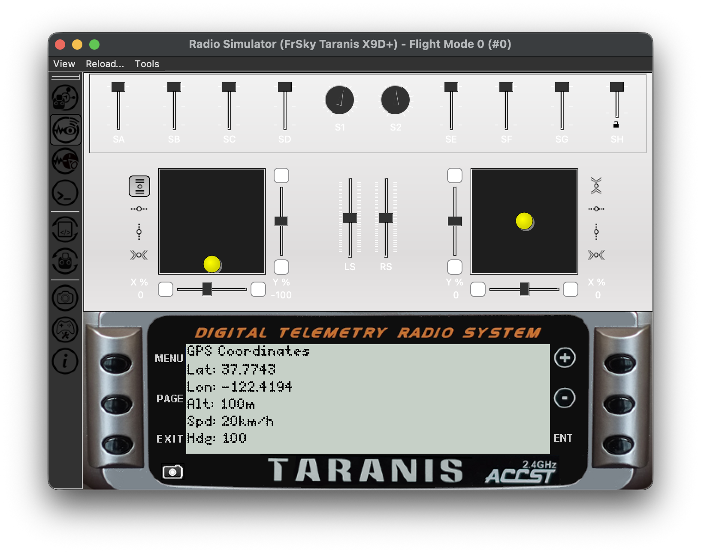

# OpenTX Scripts

Lua telemetry scripts for OpenTX/FreedomTX firmware on TBS Tango 2 controller.

## Features

**GPS Telemetry** - Real-time display of:
- GPS coordinates (lat/lon)
- Altitude (meters)
- Speed (km/h, converted from knots)
- Heading (degrees)

## Installation

1. Copy `SCRIPTS/TELEMETRY` scipts to the same folder on SD card
2. Configure telemetry script in model settings
3. Select `gps.lua` from telemetry screens

## Hardware

- **Controller**: TBS Tango 2
- **Display**: 128x64 monochrome LCD
- **Firmware**: OpenTX 2.2+ / FreedomTX

## Development

Test scripts using OpenTX Companion Simulator before deploying to hardware.

## Author

Artem Novichkov, https://artemnovichkov.com

## License

The project is available under the MIT license. See the [LICENSE](./LICENSE) file for more info.
